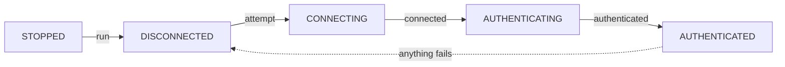

# Connection and lifecycle

> [简体中文](../zh-cn/02-lifecycle.md)

## The state machine

`plugin.state` is one of five values. The happy path is a straight line, and every failure comes back
through `DISCONNECTED`, which is the state a plugin waits in before its next attempt:

| From             | What happened                       | To                                            | Hook                     |
| ---------------- | ----------------------------------- | --------------------------------------------- | ------------------------ |
| `STOPPED`        | `run()`                             | `DISCONNECTED`                                | —                        |
| `DISCONNECTED`   | the next attempt starts             | `CONNECTING`                                  | `on_connecting`          |
| `CONNECTING`     | the socket is up                    | `AUTHENTICATING`                              | `on_connected`           |
| `CONNECTING`     | connect failed                      | `DISCONNECTED`, retry after `reconnect_delay` | `on_connect_failed`      |
| `AUTHENTICATING` | authenticated                       | `AUTHENTICATED`                               | `on_authenticated`       |
| `AUTHENTICATING` | authentication failed               | `DISCONNECTED`, retry after `reconnect_delay` | `on_authenticate_failed` |
| `AUTHENTICATING` | refused in a way a retry cannot fix | `STOPPED`                                     | `on_authenticate_failed` |
| `AUTHENTICATED`  | the connection dropped              | `DISCONNECTED`, retry after `reconnect_delay` | `on_connection_closed`   |
| any              | `stop()`                            | `STOPPED`                                     | —                        |

The one distinction worth remembering is `STOPPED` versus `DISCONNECTED`: the first means "this will
not come back on its own" (someone called `stop()`, or authentication failed in a way a retry cannot
fix), the second means "a reconnect is coming". See [When things fail](./05-failures.md).

## The hooks

Every hook is a `Hook` object registered with `@plugin.on_xxx`. A hook takes several handlers and
**starts** them in registration order; they are tasks, so completion order is not guaranteed.

| Hook                          | Fires when                                                  | Arguments         |
| ----------------------------- | ----------------------------------------------------------- | ----------------- |
| `on_connecting`               | Before every connect attempt, reconnects included           | —                 |
| `on_connected`                | The socket is up, before authentication                     | —                 |
| `on_connect_failed`           | `connect` failed (a retry follows after a delay)            | `e: Exception`    |
| `on_connection_closed`        | The receive loop ended on an exception                      | `e: Exception`    |
| `on_disconnect_failed`        | A disconnect the plugin performs on its own failed          | `e: Exception`    |
| `on_parse_data_error`         | A frame failed to parse (the envelope, or an event payload) | `raw, e`          |
| `on_authentication_token_got` | A token was just obtained                                   | `token: str`      |
| `on_authenticated`            | Authentication succeeded (**once per session**)             | —                 |
| `on_authenticate_failed`      | Authentication failed                                       | `e: Exception`    |
| `on_handler_run_failed`       | One of your handlers raised                                 | `e: Exception`    |
| `on_subscribe_failed`         | A declared event's subscription was refused                 | `registration, e` |
| `on_recv_raw`                 | Any frame arrived, before parsing                           | `raw`             |
| `on_before_send_raw`          | A request is about to go out                                | `payload: str`    |

`on_recv_raw` and `on_before_send_raw` are the packet-capture pair: they hand you the raw JSON
strings, which is how you answer "what did we actually send and receive". The authentication frames
carry the token, so filter them out before logging or sharing a capture.

## `run()` and `stop()`

- `await plugin.run()` starts the supervisor task and returns it. Awaiting it blocks until the
  supervisor ends; calling it while it is running raises `RuntimeError`.
- `await plugin.stop()` marks the plugin stopped (`plugin.state` becomes `STOPPED`), cancels the
  supervisor — making that `run()` await raise `CancelledError` — **cancels and awaits every handler
  still running**, and closes the socket (pending requests end as `CancelledError`).
- So a handler must tolerate cancellation: swallowing or blocking on `CancelledError` keeps the whole
  program from exiting. See [ADR-0006](../../adr/0006-handler-dispatch-is-fire-and-forget.md).
- A teardown that fails during `stop()` reaches the caller of `stop()`; a disconnect the reconnect
  loop performs on its own reaches `on_disconnect_failed` instead.
- After `stop()` you may `run()` again; it goes through connect and authenticate from the top.
- `stop()` forgets only the run it ended, so a `run()` called while a stop is still unwinding keeps
  running, and a later `stop()` still ends it.

## Reconnect semantics

One supervisor task loops forever: connect, authenticate, receive until the socket fails, wait
`reconnect_delay`, repeat. **Fixed delay, unlimited attempts, no backoff, no jitter**;
`reconnect_delay` defaults to 5 seconds. A failed connect and a failed authentication go through the
same loop, and since an attempt is a loopback call, backoff would buy nothing. The reasoning is in
[ADR-0007](../../adr/0007-reconnect-is-a-fixed-delay-loop.md).

Two consequences for your code:

1. `on_authenticated` fires **again** after a reconnect, which is why per-session setup lives there. It
   fires only for a session that is still live: a drop that lands while the declared events are being
   re-sent opens the next session instead of running the hook against a socket that is already gone.
2. Before the `on_authenticated` handlers run, every event you declared with `subscribe_event` is
   subscribed to again; a refusal reaches `on_subscribe_failed` instead of ending the session. So the
   hook sees a live subscription, not a promise of one.

Requests in flight are never resumed or re-sent; see
[Requests](./03-requests.md#what-happens-to-pending-requests-on-a-disconnect).

### Asking for a reconnect

`plugin.reconnect()` is the public way to ask for a fresh session. A run owns the session, so the call
is a request rather than a takeover:

- **With a run in progress, the call only drops the current session.** The run opens and authenticates
  the next one without waiting out `reconnect_delay`, so a drop that is still mid-wait retries at
  once. VTS itself may take a moment to accept the next socket: quick, not instant.
- **Without a run in progress, the call connects itself**, and nothing reconnects it afterwards. That
  connect belongs to the plugin, not to the caller: a failure reaches every caller that waited on it,
  and `stop()` cancels it.
- **`reconnect(wait_connect=True)` waits for the new socket only**, not for authentication, and stops
  waiting as soon as the run ends; `on_authenticated` is the signal that the session is usable. Without
  a run, a call that joins a connect already in flight waits for that connect and raises what it
  raised; with a run in progress it still waits for the socket, since the run retries a failed connect.
- **A reconnect already in flight is exactly what the call asks for**, so the call does nothing.
- **It does not raise while a run is in progress**; `stop()` is still how a run ends.
- **After `stop()` the call raises `RuntimeError`** until `run()` starts the plugin again: a stopped
  plugin does not connect, and a connect that was already in flight when the stop arrived is closed
  instead of adopted ([ADR-0021](../../adr/0021-a-connect-has-an-owner.md)). A run that ended on a
  fatal authentication refusal refuses the same way
  ([ADR-0016](../../adr/0016-fatal-authentication-refusals-end-the-run.md)).

## Where to put what

| You want to                                | Put it in                        |
| ------------------------------------------ | -------------------------------- |
| Read config, build objects, set up logging | module level or `main()`         |
| Declare events to subscribe to             | module level, once               |
| Create custom parameters                   | `on_authenticated` (per session) |
| Fetch a model or item list once            | `on_authenticated` (per session) |
| Do work when an event arrives              | the handler registered for it    |
| Clean up                                   | after `stop()` returns           |

## Next

[Requests](./03-requests.md) · [Events](./04-events.md) · [When things fail](./05-failures.md)
