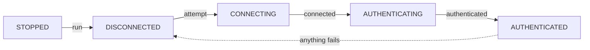

# 连接与生命周期

> [English](../en/02-lifecycle.md)

## 状态机

`plugin.state` 是这五个值之一。正常路径是一条直线，而**任何失败都回到 `DISCONNECTED`**——那是插件
在下次尝试之前等待的状态：

| 当前状态         | 发生了什么             | 下一个状态                                  | 触发的 hook              |
| ---------------- | ---------------------- | ------------------------------------------- | ------------------------ |
| `STOPPED`        | `run()`                | `DISCONNECTED`                              | —                        |
| `DISCONNECTED`   | 开始下一次尝试         | `CONNECTING`                                | `on_connecting`          |
| `CONNECTING`     | socket 连上            | `AUTHENTICATING`                            | `on_connected`           |
| `CONNECTING`     | 连接失败               | `DISCONNECTED`，等 `reconnect_delay` 后重试 | `on_connect_failed`      |
| `AUTHENTICATING` | 鉴权成功               | `AUTHENTICATED`                             | `on_authenticated`       |
| `AUTHENTICATING` | 鉴权失败               | `DISCONNECTED`，等 `reconnect_delay` 后重试 | `on_authenticate_failed` |
| `AUTHENTICATING` | 重试也修不了的鉴权拒绝 | `STOPPED`                                   | `on_authenticate_failed` |
| `AUTHENTICATED`  | 连接断开               | `DISCONNECTED`，等 `reconnect_delay` 后重试 | `on_connection_closed`   |
| 任意状态         | `stop()`               | `STOPPED`                                   | —                        |

`STOPPED` 与 `DISCONNECTED` 的区别值得记一下：前者是「不会自己起来了」（调过 `stop()`，或者撞上了
无法重试的鉴权失败），后者是「正在重连」。见 [出错的时候](./05-failures.md)。

## hook 清单

每个 hook 都是 `Hook` 对象，用 `@plugin.on_xxx` 注册，可以挂多个 handler，按注册顺序**启动**。
它们都是 task，完成顺序不保证。

| hook                          | 什么时候触发                                 | 参数              |
| ----------------------------- | -------------------------------------------- | ----------------- |
| `on_connecting`               | 每次尝试连接之前（重连也触发）               | —                 |
| `on_connected`                | socket 连上、鉴权之前                        | —                 |
| `on_connect_failed`           | `connect` 失败（之后会等一会儿重试）         | `e: Exception`    |
| `on_connection_closed`        | 收包循环因异常结束                           | `e: Exception`    |
| `on_disconnect_failed`        | 库自己发起的一次断开失败了                   | `e: Exception`    |
| `on_parse_data_error`         | 帧解析失败（信封本身，或事件载荷解不成模型） | `raw, e`          |
| `on_authentication_token_got` | 首次申请到 token                             | `token: str`      |
| `on_authenticated`            | 鉴权成功（**每个会话一次**）                 | —                 |
| `on_authenticate_failed`      | 鉴权失败                                     | `e: Exception`    |
| `on_handler_run_failed`       | 某个 handler 抛了异常                        | `e: Exception`    |
| `on_subscribe_failed`         | 声明过的事件的订阅被拒绝                     | `registration, e` |
| `on_recv_raw`                 | 收到任何帧，解析之前                         | `raw`             |
| `on_before_send_raw`          | 即将发出一个请求                             | `payload: str`    |

`on_recv_raw` / `on_before_send_raw` 是一对抓包用的钩子：拿到的是原样的 JSON 字符串，适合排查
「到底发出去/收回来什么」。

## `run()` 与 `stop()`

- `await plugin.run()` 启动 supervisor 任务并返回它。已经在跑时再调会 `RuntimeError`。
- `await plugin.stop()` 做四件事：置 `stopped`、**取消并等待所有在跑的 handler 任务**、关掉 socket
  （此时在途请求以 `CancelledError` 结束）、取消 supervisor。
- 因此 handler 必须容忍取消：吞掉或阻塞 `CancelledError` 会让整个程序退不出去。见
  [ADR-0006](../../adr/0006-handler-dispatch-is-fire-and-forget.md)。
- `stop()` 期间断开失败会抛给 `stop()` 的调用方；重连循环自己发起的断开失败则报给
  `on_disconnect_failed`。
- `stop()` 之后可以再 `run()`，会重新走一遍连接与鉴权。

## 重连语义

一个 supervisor 任务无限循环：连接 → 鉴权 → 收包直到 socket 出错 → 等 `reconnect_delay` → 再来。
**定延、无限次、无退避、无抖动**，`reconnect_delay` 默认 5 秒。连接失败和鉴权失败走同一个循环，
成本只是回环重试，所以没有做退避。理由见
[ADR-0007](../../adr/0007-reconnect-is-a-fixed-delay-loop.md)。

对使用者的两个结论：

1. 重连成功后 `on_authenticated` 会**再次**触发，所以每会话初始化都写在那里。
2. `on_authenticated` 的 handler 跑之前，所有用 `subscribe_event` 声明过的事件都会重新订阅一次；订阅被
   拒绝时会走 `on_subscribe_failed`，而不是结束会话。所以这个 hook 看到的是已经生效的订阅，而不是一个
   承诺。

断开时在途请求**不会**被续传，也不会重发，失败方式见
[发请求](./03-requests.md#断线时在途请求会怎样)。

## 该在哪里做初始化

| 想做的事               | 放哪里                        |
| ---------------------- | ----------------------------- |
| 读配置、建对象、装日志 | 模块顶层或 `main()`           |
| 声明要订阅的事件       | 模块顶层，只做一次            |
| 创建自定义参数         | `on_authenticated`（每会话）  |
| 拿一次模型/物品列表    | `on_authenticated`（每会话）  |
| 收到事件后干活         | `handle_event` 注册的 handler |
| 收尾、关资源           | `stop()` 之后                 |

## 下一步

[发请求](./03-requests.md) · [事件](./04-events.md) · [出错的时候](./05-failures.md)
